# Bedienung der App

Beschreibung der Bildschirme und Knöpfe (Beschriftungen aus dem Code, mit Screenshots abgeglichen) (Stand: `main` mit Release `v0.1.36`). Einrichtung und Fehlersuche:
[EINRICHTUNG.md](EINRICHTUNG.md). Überblick: [README.md](../README.md).

> Die Screenshots (`docs/bilder/`) stammen vom Xiaomi-Tablet mit Version 0.1.36 (16df1e6). Die Beschreibung folgt dem Quellcode und wurde
> mit den Screenshots abgeglichen. QR-Codes und der Nextcloud-Link auf den Bildern sind geschwärzt bzw. durch einen Platzhalter ersetzt.

## Ablauf im Überblick

Splash (ca. 2 s, mit Versionsanzeige) → **Setup-Modus** (Einrichtung) → **Start** → **Retail-Modus** (Gäste): Startbildschirm → Kamera → Ergebnis → zurück zum Startbildschirm.

## 1. Setup-Modus (Personal)

Oben die Reiter, unten der grosse **Start**-Knopf, oben rechts **⏻** (App beenden, verlangt die PIN). Unten steht die aktive Konfiguration mit Version. Das ⏻-Symbol oben rechts wird auf dem Tablet als Kästchen-Zeichen dargestellt (Symbol fehlt in der Schrift), der Knopf öffnet trotzdem die PIN-Abfrage «App beenden».

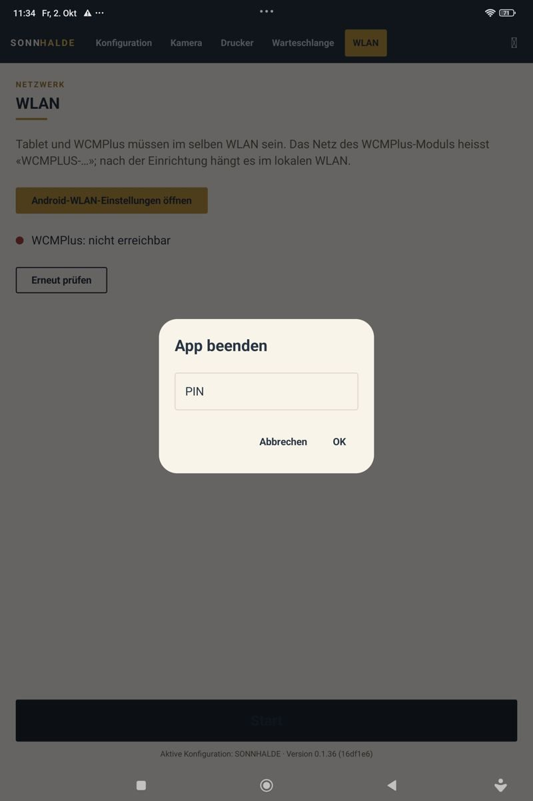

### Reiter «Konfiguration»

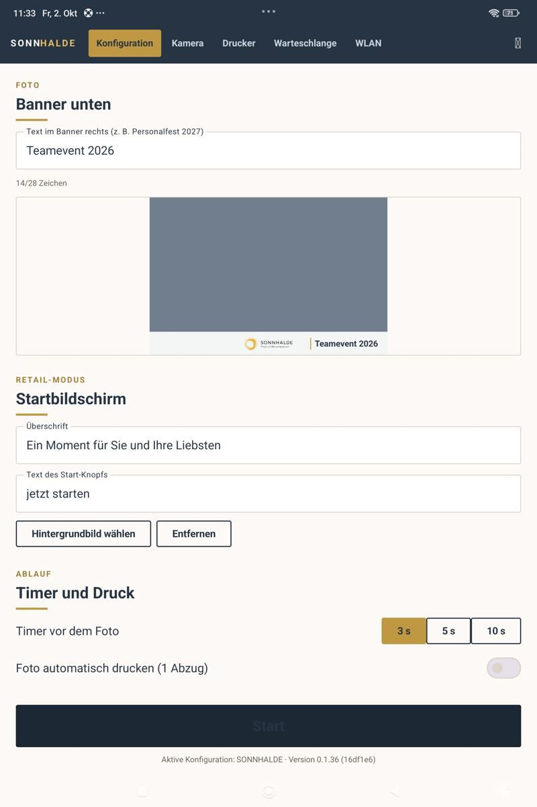
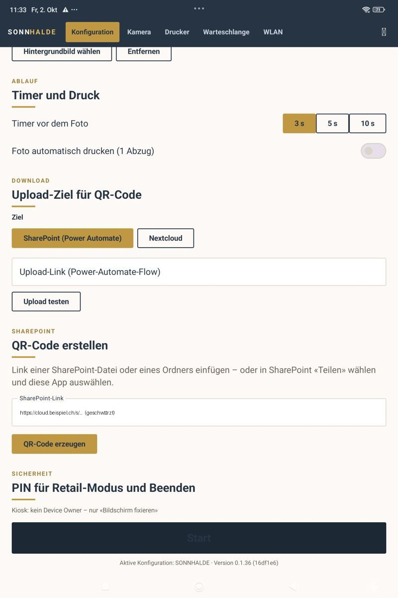

| Bereich | Inhalt |
|---|---|
| **Foto – Banner unten** | Feld «Text im Banner rechts» (max. 28 Zeichen, Zähler und **Vorschau** darunter) |
| **Retail-Modus – Startbildschirm** | «Überschrift», «Text des Start-Knopfs», **Hintergrundbild wählen** / **Entfernen** |
| **Ablauf – Timer und Druck** | «Timer vor dem Foto»: **3 s / 5 s / 10 s**; Schalter «Foto automatisch drucken (1 Abzug)» |
| **Download – Upload-Ziel für QR-Code** | Ziel «SharePoint (Power Automate)» oder «Nextcloud» mit den jeweiligen Feldern, **Upload testen** (zeigt Link und QR-Code zum Testfoto) |
| **SharePoint – QR-Code erstellen** | Hilfsfunktion: einen SharePoint-Link einfügen → **QR-Code erzeugen**, dann **Herunterladen** / **Teilen** |
| **Sicherheit – PIN** | Anzeige «Kiosk: Device Owner (volle Sperre)» bzw. «kein Device Owner – nur «Bildschirm fixieren»»; «Neue PIN (mind. 4 Zeichen)» → **PIN speichern** |

### Reiter «Kamera»

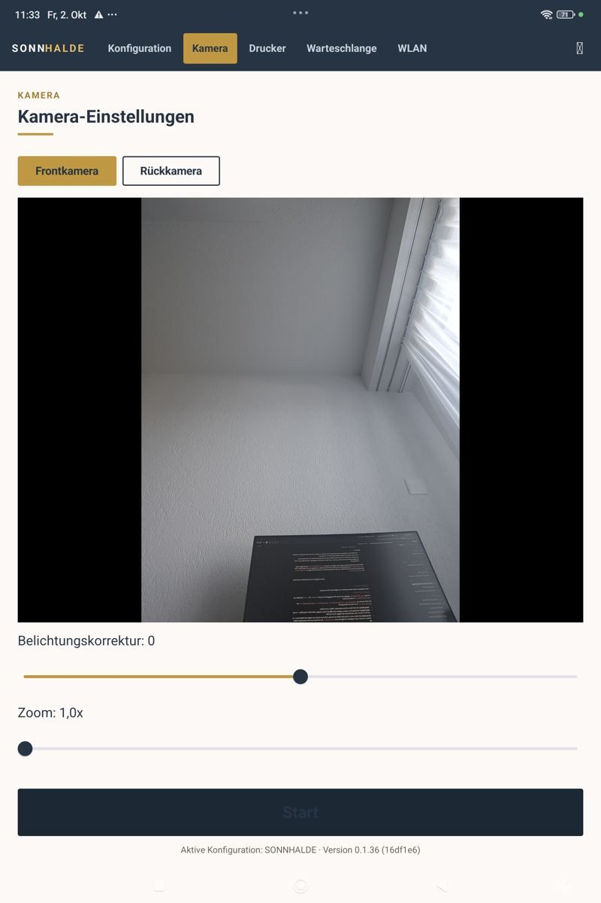

Live-Vorschau (4:3). **Frontkamera** / **Rückkamera**, Schieberegler **Belichtungskorrektur** und **Zoom**. Fehlt die Berechtigung, steht
«Bitte Kamera-Zugriff erlauben.».

### Reiter «Drucker»

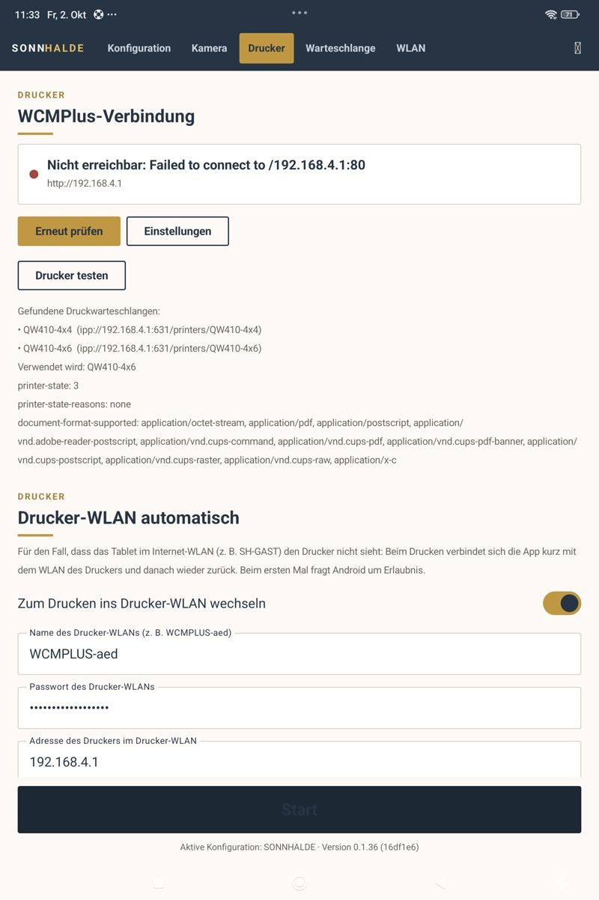
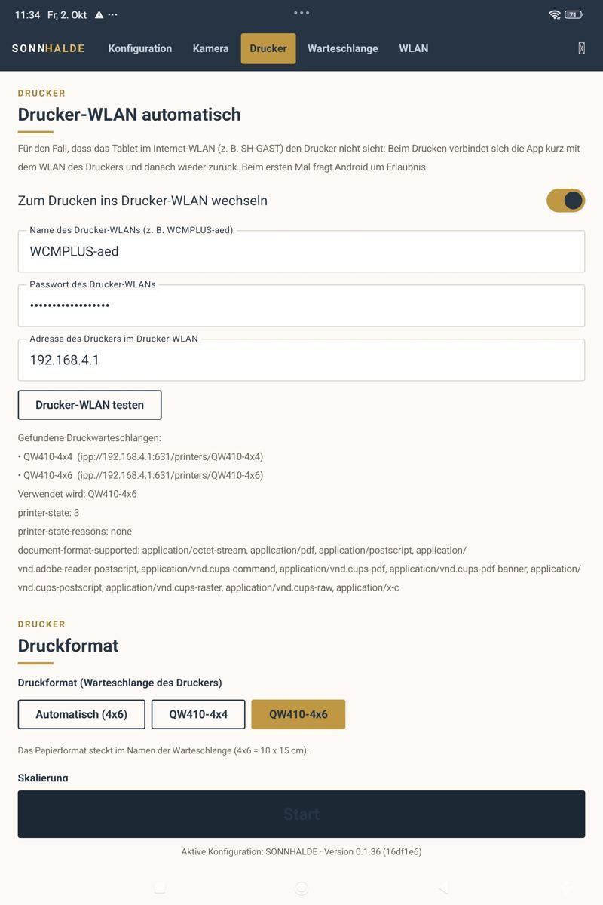
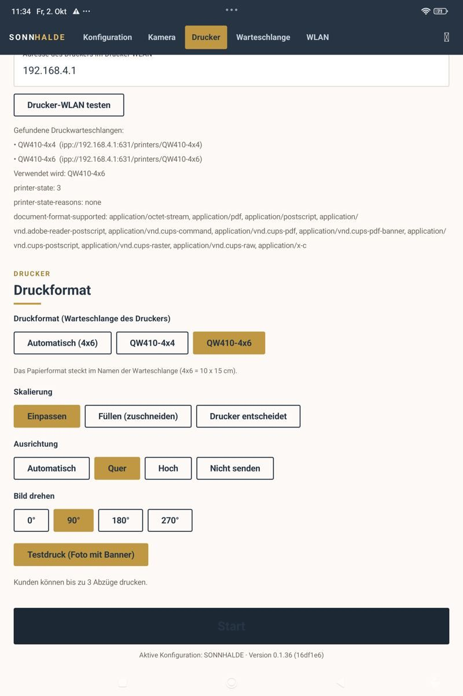

1. **WCMPlus-Verbindung:** Statuspunkt (grün = verbunden, rot = nicht erreichbar) mit Adresse; **Erneut prüfen**, **Einstellungen** (Adresse von
   WCMPlus, Pfad für Verbindungstest, Token optional, Drucker-Adresse IPP – leer = automatisch), **Drucker testen**.
   Das Ergebnis erscheint darunter: «Gefundene Druckwarteschlangen» (z. B. `QW410-4x4`, `QW410-4x6` mit IPP-Adresse), «Verwendet wird: QW410-4x6», `printer-state`, `printer-state-reasons` und die unterstützten Dokumentformate.
   Im Screenshot steht die WCMPlus-Verbindung auf «Nicht erreichbar» (Portal `192.168.4.1:80`), obwohl die Druckwarteschlangen gefunden wurden: Portal-Prüfung und Druckersuche sind getrennte Abfragen.
2. **Drucker-WLAN automatisch:** Schalter «Zum Drucken ins Drucker-WLAN wechseln», Name, Passwort und Adresse des Drucker-WLANs,
   **Drucker-WLAN testen**.
3. **Druckformat:** «Druckformat (Warteschlange des Druckers)», «Skalierung» (Einpassen / Füllen (zuschneiden) / Drucker entscheidet),
   «Ausrichtung» (Automatisch / Quer / Hoch / Nicht senden), «Bild drehen» (0°/90°/180°/270°), **Testdruck (Foto mit Banner)**.
   Hinweis in der App: Gäste können bis zu 3 Abzüge drucken. «Druckformat» bietet «Automatisch (4x6)», `QW410-4x4` und `QW410-4x6`. Im Screenshot sind Einpassen, Quer und 90° gewählt (Werte dieses Tablets, keine allgemeine Empfehlung).

### Reiter «Warteschlange»

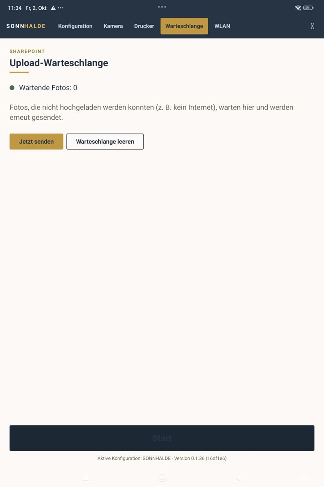

«Wartende Fotos: N» (grün bei 0, sonst rot). Nicht hochgeladene Fotos warten hier. **Jetzt senden** versucht den Upload erneut,
**Warteschlange leeren** verwirft die wartenden Fotos. Am Reiter steht die Anzahl in Klammern.

### Reiter «WLAN»

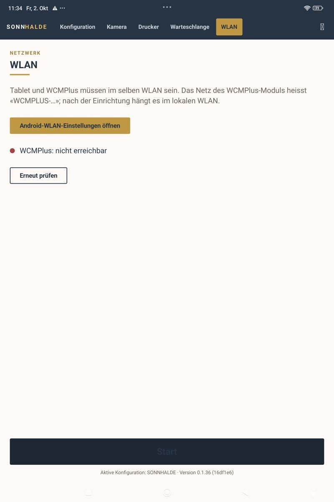

Hinweis zum Netz, der Knopf **Android-WLAN-Einstellungen öffnen**, darunter der WCMPlus-Status (im Screenshot «WCMPlus: nicht erreichbar», weil das Tablet im Internet-WLAN war) und **Erneut prüfen**.

## 2. Retail-Modus (Gäste)

1. **Startbildschirm:**

   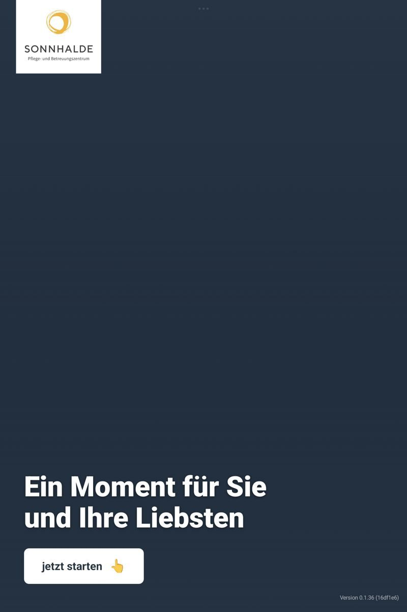

    Hintergrundbild, Logo, Überschrift und der weisse Start-Knopf (Text einstellbar). Unten rechts klein die Version. Ist der Kiosk nicht gesperrt, erscheint oben rechts der Hinweis «Kiosk-Sperre nicht aktiv: in den Android-Einstellungen «Bildschirm fixieren» einschalten (oder App als Device Owner einrichten).» ([Bild](bilder/welcome-hinweis.jpg)).
2. **Kamera:**

   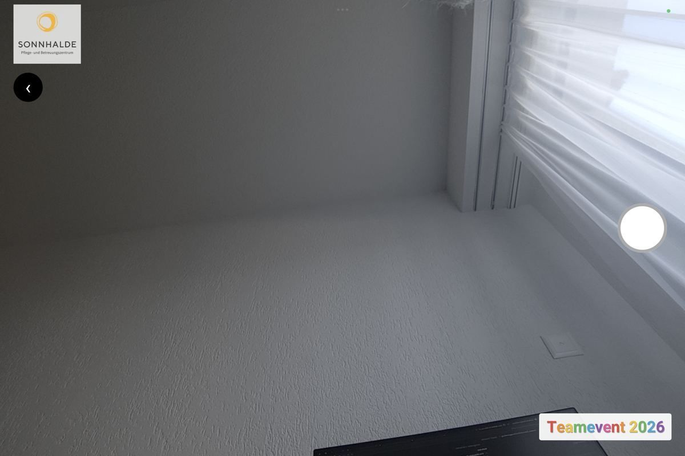

    Live-Bild. Ein **Tipp irgendwo auf das Bild** oder auf den **runden Auslöser** rechts startet den Timer; der Countdown erscheint gross
   in der Mitte. Oben links Logo und der Knopf **‹** (zurück zum Start). Unten rechts der Text-Sticker. Fehlt die Berechtigung:
   «Bitte Kamera-Zugriff erlauben.».
3. **Ergebnis («Ihr Foto»)** (Querformat, QR-Code geschwärzt):

   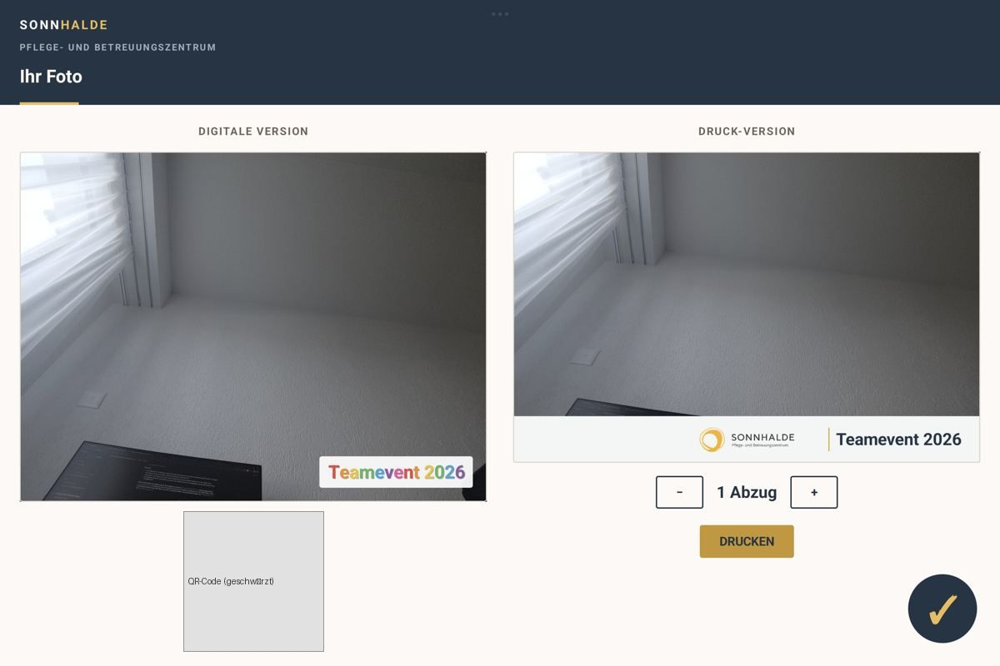

  
   - Links bzw. oben **DIGITALE VERSION** mit QR-Code und «ZUM HERUNTERLADEN SCANNEN». Während des Uploads «QR-Code wird erstellt …».
     Schlägt es fehl: Hinweis «Der Download-Link konnte nicht erstellt werden …» und **Nochmals versuchen** (das Foto wartet zusätzlich in der Warteschlange).
   - Rechts bzw. unten **DRUCK-VERSION** mit **−** / **+** (Anzahl Abzüge, 1–3) und **DRUCKEN**. Danach der Fortschritt, bei Erfolg
     «Ihr Foto wird gedruckt.». Bei Fehler «Drucken nicht möglich …» und der Ausweg **Über Android-Druckdialog drucken**.
   - Der grosse **✓**-Knopf unten rechts beendet und führt zum Startbildschirm. Nach **90 Sekunden** ohne Eingabe passiert das automatisch.
   - Ist «Foto automatisch drucken» eingeschaltet, startet der Druck (1 Abzug) ohne Knopfdruck.

### Verwaltung / Beenden aus dem Retail-Modus

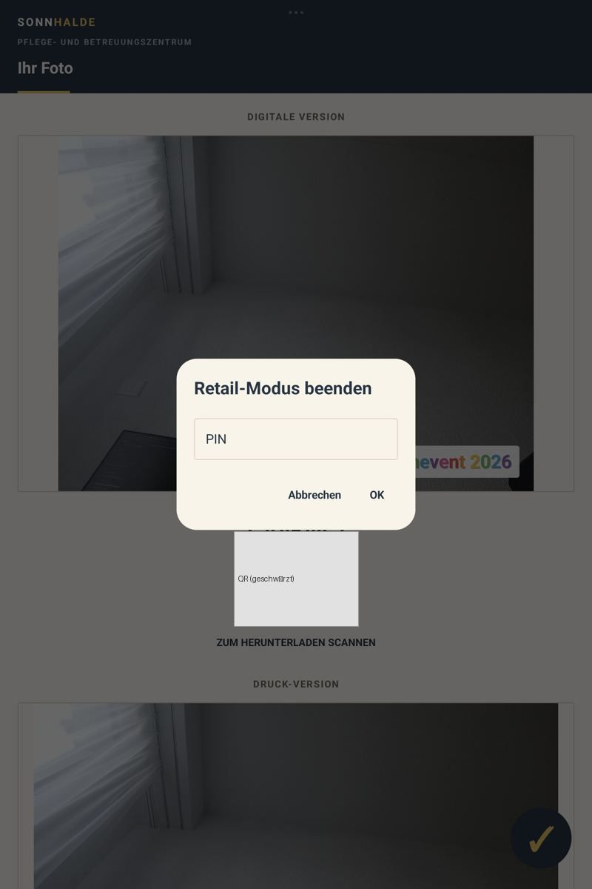

**Langer Druck** auf das Logo (Startbildschirm, Kamera) bzw. den Banner (Ergebnis) öffnet die PIN-Abfrage «Retail-Modus beenden» (Feld «PIN», bei falscher Eingabe «PIN falsch»,
**OK** / **Abbrechen**). Mit richtiger PIN geht es zurück in den Setup-Modus; ⏻ dort beendet die App.

## Offen

- Nicht als Screenshot vorhanden: Ergebnis-Seite bei Upload-/Druckfehler («Nochmals versuchen», «Über Android-Druckdialog drucken»), laufender Countdown, Android-Systemfenster beim WLAN-Wechsel.
- Das Kästchen-Zeichen statt ⏻ ist eine Beobachtung vom Tablet; ob es ein Schriftproblem der App ist, ist ungeklärt.
